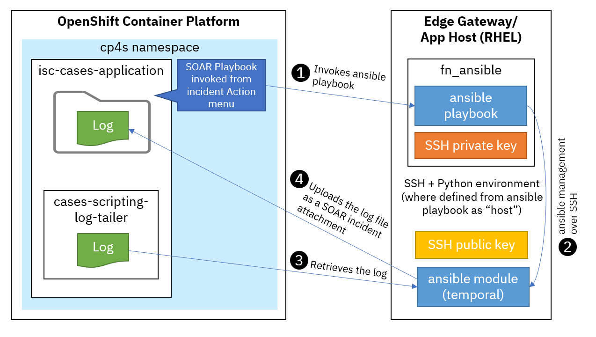
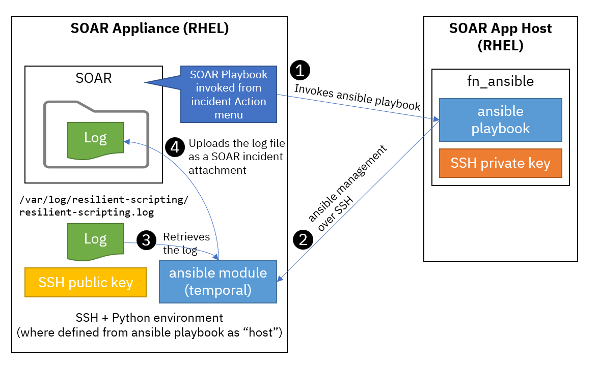
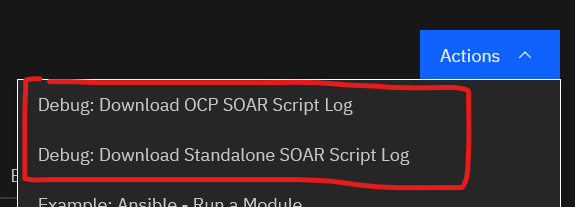
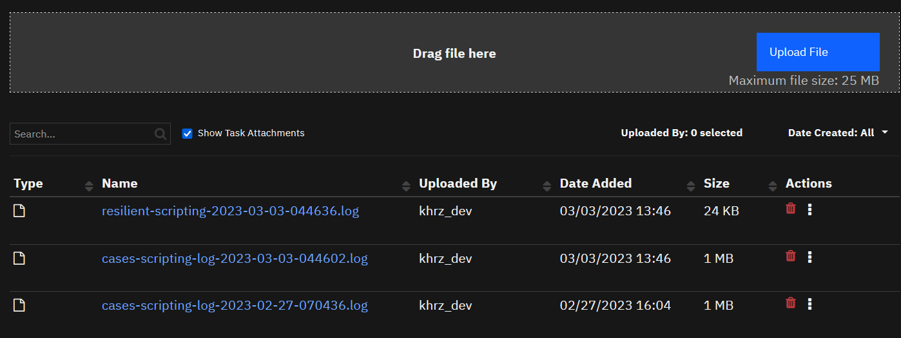

# Experimental: SOAR Script Log Downloader

- [Overview](#overview)
- [Requirements](#requirements)
- [Installation](#installation)
- [How to Use](#how-to-use)
- [Considerations](#considerations)

---

## Overview
Some of the QRadar SOAR logs are only available from the platform, not from the SOAR UI. This makes playbook developers inefficient when they debug the scripts unless they have free access to the underlying platform. Giving platform access to every developers is not always possible even for development instance.

This experimental playbook allows you to enable your playbook developers to download the following logs from the SOAR UI's Incident Attachment:

* `cases-scripting-log-tailer` in the `isc-cases-application` pod (OpenShift Container Platform)
* /var/log/resilient-scripting/`resilient-scripting.log` (SOAR appliance)

---

## Requirements
* CP4S 1.10.7+ or SOAR 45.2+
* An App Host (Edge Gateway) for `fn_ansible` app
* A Linux machine for running ansible playbooks
  * For CP4S SOAR
    * You may use App Host as a Linux machine if you can add SSH public key.
    * `fn_ansible` on App Host does not support running playbooks inside the container, so you need SSH connection from the App Host container to a Linux machine to run playbooks.
    * Default `fn_ansible` image does not come with SSH password support so SSH key setup is needed.

  * For standalone SOAR appliance
    * As the target log file is inside the SOAR appliance and the ansible playbook is written to read it as a local file, `host` must be a SOAR appliance itself so you need SSH connection from the App Host container to the SOAR appliance to run playbooks.
    * Default `fn_ansible` image does not come with SSH password support so SSH key setup is needed.
    * As the target log's permission is by default limited to `res-scripting` user, you'll need a root privilege to read the file. If your ansible user is not the root but can become the root (such as resadmin), NOPASSWD sudo setting will be needed.


### Integration Diagram

For CP4S SOAR, ansible playbook interacts with the OCP API to retrieve the log and the SOAR API to upload the file.



For standalone SOAR appliance, ansible playbook module runs on the appliance locally to get the log and interacts with the SOAR API to upload the file.



---

## Installation
### Import SOAR Playbooks

Follow the steps described in the [soar-playbooks](./soar-playbooks) folder.

### Import Ansible Playbooks

Follow the guide in the [ansible-playbooks](./ansible-playbooks) folder.

---

## How to Use

In any incident you are working on, invoke the following menu item from the Actions menu:

- Debug: Download OCP SOAR Script Log
- Debug: Download Standalone SOAR Script Log



Once done, you'll see the complete message as a note like:

```json
{"summary": "successful", "content": "4 items are returned for the parameters: {'ansible_parameters': 'case_id=2324', 'ansible_playbook_name': 'soar_log_downloader.yml'}"}
```

or

```json
{"summary": "successful", "content": "4 items are returned for the parameters: {'ansible_parameters': 'case_id=2324', 'ansible_playbook_name': 'ocp_cases_log_downloader.yml'}"}
```

or something like this when failed. (in this example, the necessary file `multipart.j2` was missing)

```json
{"summary": "failed", "content": {"msg": "Could not find or access  'multipart.j2'\nSearched  in:\n\t/tmp/tmpmlt0mu_v/private/project/templates/multipart.j2\n\t/tmp/tmpmlt0mu_v/private/project/multipart.j2\n\t/tmp/tmpmlt0mu_v/private/project/templates/multipart.j2\n\t/tmp/tmpmlt0mu_v/private/project/multipart.j2 on the Ansible Controller.\nIf you are using a module and expect the  file to exist on the remote, see the remote_src option",  "_ansible_no_log": false, "changed": false}}
```

When successful, you'll see your attachment on the Attachment tab.



## Considerations

This experimental playbook is not intended to cover production environment as playbook development is more likely to be on the development SOAR instance.

The way it works doesn't agree with SaaS operation so the playbook does not work on SaaS.

By the nature of giving an access to the platform to *non*-admins, **security** is the primary concern.

- For standalone SOAR appliance, as the target log's permission is by default limited to `res-scripting` user, you'll need a root privilege to read the file. This means your ansible playbook's SSH public key must be added to the root or any other user who can become the root. SSH private key is part of the files deployed to each Edge Gateway/App Host and you'll need to protected the server with extra care.
- OpenShift access control to the pod's log is more granular and can limit the operation to get and list. But you still need to protect the Edge Gateway/App Host as it contains the service account access token to the platform.
- This experimental playbook is intended to give the admin to allow playbook developers retrieving the script logs without giving the entire platform access. Playbook developers usually have more privilege than ordinary SOAR user. If they have an access to fn_ansible app's playbook files, they'll soon get the platform specific secrets to access the platform directly. Please avoid that situation by limiting the access to the application.
- Scripting log itself is rather confidential. So modifying the SOAR Playbook activation condition is also important. By default no condition is set so anyone can see this playbook as an incident menu item.
